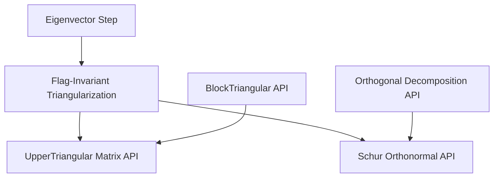

# Principled Schur Redesign

## Architecture
Introduce a general algebraic layer first, then keep the analytic Schur layer thin.



## Files To Touch
- [`/Users/mariagrazia/mathlib4/Untitled/Mathlib/LinearAlgebra/Basis/Flag.lean`](/Users/mariagrazia/mathlib4/Untitled/Mathlib/LinearAlgebra/Basis/Flag.lean): add the basis/flag formulation of triangularization.
- [`/Users/mariagrazia/mathlib4/Untitled/Mathlib/LinearAlgebra/Eigenspace/Triangularizable.lean`](/Users/mariagrazia/mathlib4/Untitled/Mathlib/LinearAlgebra/Eigenspace/Triangularizable.lean): replace the existing TODO with the algebraic theorem over `[IsAlgClosed K]`.
- [`/Users/mariagrazia/mathlib4/Untitled/Mathlib/LinearAlgebra/Matrix/Block.lean`](/Users/mariagrazia/mathlib4/Untitled/Mathlib/LinearAlgebra/Matrix/Block.lean) or a small companion file: connect flag invariance to `Matrix.IsUpperTriangular` without duplicating `BlockTriangular`.
- [`/Users/mariagrazia/mathlib4/Untitled/Mathlib/LinearAlgebra/Matrix/SchurTriangulation.lean`](/Users/mariagrazia/mathlib4/Untitled/Mathlib/LinearAlgebra/Matrix/SchurTriangulation.lean): shrink to Schur-specific choices and the final unitary-similarity statement.

## Proposed API Shape
Use flags and invariant submodules as the primitive concept, not ad hoc matrix entries:

```lean
def Module.End.IsTriangularizedBy (f : Module.End K E) (b : Module.Basis (Fin n) K E) : Prop :=
  ∀ k : Fin (n + 1), b.flag k ∈ f.invtSubmodule
```

Then prove the bridge once:

```lean
theorem Module.End.isTriangularizedBy_iff_isUpperTriangular_toMatrix :
    f.IsTriangularizedBy b ↔ (LinearMap.toMatrix b b f).IsUpperTriangular := ...
```

The algebraic theorem should be stated independently of inner products:

```lean
theorem Module.End.exists_isTriangularizedBy
    [IsAlgClosed K] [FiniteDimensional K E] (f : Module.End K E) :
    ∃ n, ∃ b : Module.Basis (Fin n) K E, f.IsTriangularizedBy b := ...
```

## Implementation Strategy
- Build the algebraic induction from `Module.End.exists_eigenvalue`, `HasEigenvalue.exists_hasEigenvector`, `Submodule.exists_isCompl`, and `Module.Basis.mkFinCons`.
- Extract a reusable one-step lemma: if `K ∙ v` is `f`-invariant and a complement is triangularized by the projected endomorphism, then the `Fin.cons` basis triangularizes `f`.
- Use `Matrix.IsUpperTriangular` only through the flag-to-matrix bridge; avoid entrywise triangular proofs outside that bridge.
- Rework `SchurTriangulation.lean` to choose the orthogonal complement and orthonormal bases via existing APIs (`Submodule.orthogonalDecomposition`, `OrthonormalBasis.prod` or the existing collected-basis API), then appeal to the general flag theorem/bridge where possible.
- Remove implementation-only public helpers from `SchurTriangulation.lean`, especially `Fin.subNat'` and `Equiv.finAddEquivSigmaCond`, unless they become generally useful and are moved to their natural homes with broader docstrings.

## Quality Bar
- Every new declaration stays under 20 lines by extracting step lemmas.
- No global instances for local proof needs; use local `letI`/`haveI` only.
- No duplicated `toMatrixOrthonormal` lemmas; rely on `Mathlib.Analysis.InnerProductSpace.Adjoint`.
- No broad `set_option maxRecDepth 10000` unless a narrow proof needs it and no structural fix is available.
- Build incrementally: first the flag API, then algebraic triangularization, then Schur, then `Mathlib.lean`.
