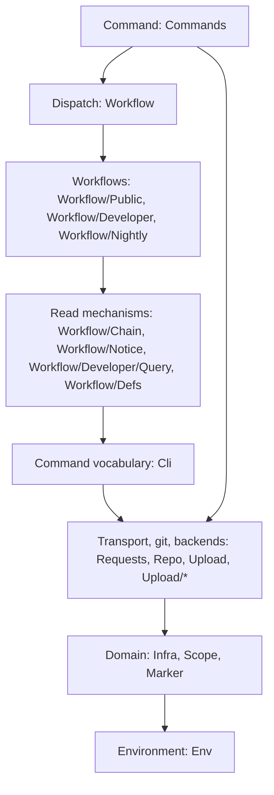
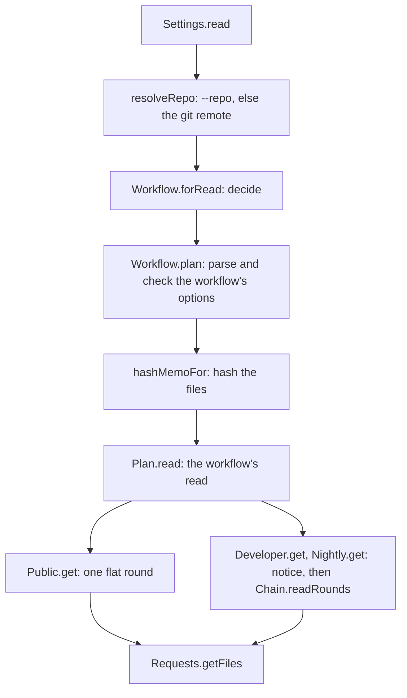

# Cache tool internals

This document describes how the code of `lake exe cache` is structured: the
layers, how a command runs, and where to make a change. The behavior of the
read workflows is in [`WORKFLOWS.md`](./WORKFLOWS.md), the trust model in
[`SECURITY.md`](./SECURITY.md), and the uploads in [`CI.md`](./CI.md).

## Layers

Each layer imports only the layers below it.

| Layer | Modules | Rules |
|-------|---------|-------|
| Command | `Commands` | Reads the decision variables once per command (`Settings.read`). Turns an error into exit status 1 (`reportErrors`). |
| Dispatch | `Workflow` | Decides the workflow of a read, plans it, and runs it. |
| Workflows | `Workflow/Public`, `Workflow/Developer`, `Workflow/Nightly` | Each owns its flags, its read hosts, and its option checks. Reads no environment variable and does not exit: it takes `Settings` from `ReadContext` and throws on an invalid option (`fail`). |
| Read mechanisms | `Workflow/Chain`, `Workflow/Notice`, `Workflow/Developer/Query`, `Workflow/Defs` | The chain read, the security notice, and the marker probes. The caller gives each read URL. |
| Command vocabulary | `Cli` | The flag value types, the flags no workflow owns (`CommonFlag`), and `Scope.flag` and `Scope.parse`. |
| Transport, git, backends | `Requests`, `Repo`, `Upload`, `Upload/*` | The download rounds, the repository detection, and the upload backends. A backend reads its own credentials. |
| Domain | `Infra`, `Scope`, `Marker` | The containers, their layouts and paths, the read base rule, the scope, and the marker paths. |
| Environment | `Env` | The `Settings` record and the rules that parse a variable's value. |

`Hashing`, `IO`, and `Lean` compute the file hashes and hold the local cache
mechanics; every layer above them can use them.

## How a command runs

`Main.main` calls `Commands.main`, which gives the arguments to the `Cli`
parser. The parser selects the subcommand and rejects an unknown flag, a flag
the command does not declare, a value of the wrong type, and a duplicate flag.
Then the handler of the subcommand runs inside `reportErrors`.

A `get` runs in this order (`runGet`):

The plan comes before the hash, so an invalid option fails before the
expensive step. The decision is pure (`forRead`). The chain-read triggers are
a fixed list in `Workflow` (`chainReadFlags`, `chainReadVariables`), apart
from the flags each workflow declares.

A `put` decides its destination (`Upload.decide`, which calls
`stagedUploadDestFrom`) before it packs, then transfers on the selected
backend (`uploadFiles`). `query` resolves the repository and calls
`Developer.query`, which returns the exit status. The local commands (`pack`,
`unpack`, `clean`, `lookup`, and the staging commands) use no workflow.

## Where to make a change

To add a flag to a workflow:

1. Define the `Cli.Flag` in the workflow module and add it to the workflow's
   `flags`.
2. Read it in the workflow's `parseOptions` or `plan`.

The `get` commands declare it through `Workflow.flags`, and the other
workflows reject it (`checkForeignFlags`). A new flag does not change the
decision unless you add it to `chainReadFlags`.

To add a decision variable, add a field to `Settings` and read it in
`Settings.read`. A workflow reads it from `ctx.settings`.

To change the hosts of a workflow, change its `readURL` (or `Public.url`).
`readBase` applies `MATHLIB_CACHE_BASE_URL` and the legacy switch to every
host.

To add a workflow:

1. Add a module under `Cache/Workflow/` with `name`, `flags`, the option
   parsing, and `get`.
2. Add a constructor to `Workflow` and to `Workflow.Plan`, and a case to
   `name`, `forRepo` or `forRead`, `plan`, and `Plan.read`.
3. Add its flags to `Workflow.flags`.
4. Describe it in `WORKFLOWS.md` and `SECURITY.md`.

To add a container, add a constructor to `Container` with its `name`, and
add it to `Container.all`. Set its layout (`flatPath`) and whether it has
per-commit namespaces (`perCommit`). `pathSegment` and `azureURL` follow the
`mathlib4-{name}` convention. Then add it to the chains and the trust
dispatch that use it.

To add an upload backend:

1. Add a constructor to `UploadBackend`, with its `name`, `parse?`, and an
   entry in `all`.
2. Add a module under `Cache/Upload/` with the credential resolution and the
   transfer.
3. Add a case to `uploadFiles`, and to `stagedUploadDestFrom` for the
   default root.

## Tests

`lake exe cache-test` runs `Cache/Test.lean`. The pure decisions (`forRead`,
`Workflow.plan` and the option parsers, `Upload.decide`,
`stagedUploadDestFrom`, `Chain.rounds`, `Notice.reason?`) take their inputs
as values, so a test passes a `Settings` value and a parsed command line
(`Commands.cache.process`) and reads no process environment.
